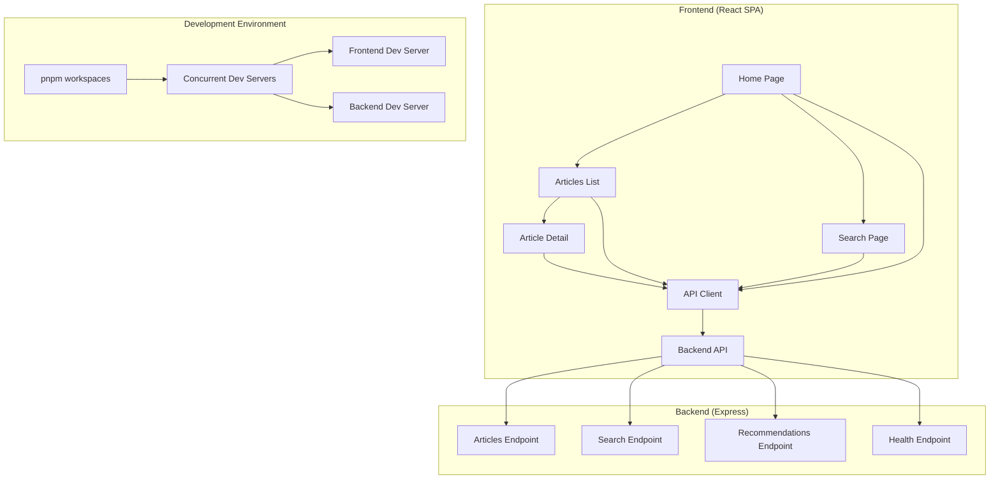

# Design Document

## Overview

The Dash0 Times application is a full-stack demo designed to generate realistic telemetry and monitoring signals while showcasing Dash0 branding and design language. The system consists of a React-based single-page application (SPA) frontend and a Node.js Express backend, structured as a monorepo with pnpm workspaces. The application simulates a news portal with intentional performance characteristics to demonstrate web vitals metrics (LCP, CLS, INP) and realistic API behaviors including variable latencies and intermittent failures. The visual design follows Dash0's brand identity from https://www.dash0.com/ to create a cohesive brand experience.

## Architecture

### High-Level Architecture



### Technology Stack

**Frontend:**
- React 18 with Vite for fast development and building
- React Router v6 for client-side routing
- Plain JavaScript (no TypeScript to keep dependencies minimal)
- CSS Modules for component styling
- Fetch API through centralized API client

**Backend:**
- Node.js with Express framework
- CORS middleware for cross-origin requests
- Plain JavaScript with ES modules
- Artificial delays using setTimeout/Promise-based timing

**Development:**
- pnpm workspaces for monorepo management
- Concurrently for running multiple dev servers
- Hot module replacement for frontend development

## Components and Interfaces

### Frontend Components

**Core Components:**
- `App.jsx` - Root component with routing setup and Dash0 theme provider
- `Layout.jsx` - Common layout with Dash0-branded navigation and footer
- `HomePage.jsx` - Hero content with Dash0 branding, CLS and INP triggers
- `ArticlesPage.jsx` - Article list with pagination and filtering using Dash0 design system
- `ArticleDetailPage.jsx` - Individual article view with recommendations in Dash0 styling
- `SearchPage.jsx` - Search interface with debouncing and error handling using Dash0 components

**Utility Components:**
- `LoadingSkeleton.jsx` - Reusable loading state component with Dash0 styling
- `ErrorMessage.jsx` - Consistent error display component using Dash0 design patterns
- `Banner.jsx` - Delayed banner for CLS demonstration with Dash0 branding
- `BrandHeader.jsx` - Dash0 logo and brand elements component

**API Layer:**
- `apiClient.js` - Centralized HTTP client with fetch wrapper
- `config.js` - Environment configuration and API base URLs
- `theme.js` - Dash0 brand colors, typography, and design tokens

### Backend Endpoints

**API Interface:**
```javascript
// GET /api/health
{ ok: true }

// GET /api/articles
{
  articles: [
    {
      id: string,
      title: string,
      excerpt: string,
      body: string,
      tags: string[],
      publishedAt: string
    }
  ],
  viewer?: { id: string, plan: string }
}

// GET /api/articles/:id
{
  article: {
    id: string,
    title: string,
    body: string,
    tags: string[],
    publishedAt: string,
    author: string
  },
  viewer?: { id: string, plan: string }
}

// GET /api/search?q=query
{
  results: Article[],
  query: string,
  timing: number
} | { error: string }

// GET /api/recommendation
{
  recommendations: Article[]
}
```

## Data Models

### Article Model
```javascript
{
  id: string,           // Unique identifier
  title: string,        // Article headline
  excerpt: string,      // Brief summary (150-200 chars)
  body: string,         // Full article content
  tags: string[],       // Category tags for filtering
  publishedAt: string,  // ISO date string
  author: string        // Author name
}
```

### User Model (Demo Authentication)
```javascript
{
  id: string,          // User identifier
  plan: string         // Subscription plan (free, pro, enterprise)
}
```

### API Response Wrapper
```javascript
{
  data: any,           // Response payload
  timing?: number,     // Request duration in milliseconds
  viewer?: User,       // Current user context (if authenticated)
  error?: string       // Error message (if applicable)
}
```

## Correctness Properties

*A property is a characteristic or behavior that should hold true across all valid executions of a system—essentially, a formal statement about what the system should do. Properties serve as the bridge between human-readable specifications and machine-verifiable correctness guarantees.*

### Property Reflection

After analyzing the acceptance criteria, I identified several properties that can be consolidated:
- Navigation properties (2.2, 2.3, 2.4, 2.5) can be combined into comprehensive routing behavior
- API timing properties (8.1, 8.2, 8.4) can be unified into response time validation  
- Error handling properties (6.4, 9.4) can be merged into consistent error state management
- Loading state properties (5.2, 6.3) can be consolidated into UI state consistency
- New tab properties (7.1, 7.2, 7.3, 7.4, 7.5) can be combined into new tab behavior validation
- API client properties (9.1, 9.2, 9.3) can be merged into centralized request handling

**Property 1: Client-side routing consistency**
*For any* valid route path, navigating to that route should update the URL, render the correct component, maintain browser history, and preserve application state without full page reload
**Validates: Requirements 2.2, 2.3, 2.4, 2.5**

**Property 2: API response timing bounds**
*For any* API endpoint call, response times should fall within the specified ranges: articles (50-150ms), article detail (800-1200ms), search (100-400ms), recommendations (200-900ms)
**Validates: Requirements 8.1, 8.2, 8.4**

**Property 3: Search error rate consistency**
*For any* series of search queries, the search endpoint should return HTTP 500 errors approximately 20% of the time over multiple requests
**Validates: Requirements 8.3**

**Property 4: Layout shift timing precision**
*For any* home page load, the banner should appear exactly 1800ms after initial render and cause measurable layout shift by pushing content downward
**Validates: Requirements 3.3**

**Property 5: Heavy computation duration bounds**
*For any* "Run analysis" button click, the computation should block the main thread for 200-400ms and then display results with execution timing
**Validates: Requirements 3.4, 3.5**

**Property 6: API client centralization**
*For any* HTTP request made by the frontend, it should go through the centralized API client module using fetch and provide consistent error handling with structured error information
**Validates: Requirements 9.1, 9.2, 9.3, 9.4**

**Property 7: New tab navigation preservation**
*For any* article opened in a new tab, the original page state should remain unchanged, the new tab should display correct content, and navigation events should be tracked separately
**Validates: Requirements 7.1, 7.2, 7.3, 7.4, 7.5**

**Property 8: Loading state consistency**
*For any* asynchronous operation (API calls), the UI should display appropriate loading states and transition to content or error states upon completion
**Validates: Requirements 5.2, 6.3**

**Property 9: Search debouncing behavior**
*For any* sequence of search input changes, requests should be debounced by exactly 300 milliseconds
**Validates: Requirements 6.1**

**Property 10: Article display format consistency**
*For any* article displayed in lists, it should show title, excerpt, tags, and published date, and provide "Open in new tab" links
**Validates: Requirements 4.2, 7.1**

**Property 11: Tag filtering accuracy**
*For any* tag filter selection, only articles matching that tag should be displayed in the results
**Validates: Requirements 4.4**

**Property 12: CORS header presence**
*For any* API endpoint call, the response should include proper CORS headers for frontend development
**Validates: Requirements 8.5**

**Property 13: Dash0 branding consistency**
*For any* page or component rendered, it should include appropriate Dash0 brand colors, visual identity, and design language consistent with https://www.dash0.com/
**Validates: Requirements 11.1, 11.2, 11.3, 11.4, 11.5**

## Error Handling

### Frontend Error Handling
- **Network Errors**: Display user-friendly messages for connection failures
- **API Errors**: Show specific error messages returned by the backend
- **Loading States**: Implement skeleton screens and spinners for pending requests
- **Route Errors**: Handle invalid routes with 404-style error pages
- **Search Failures**: Display retry options and alternative suggestions

### Backend Error Handling
- **Intentional Failures**: Search endpoint returns 500 errors 20% of the time
- **Validation Errors**: Return 400 status for malformed requests
- **Not Found**: Return 404 for non-existent articles
- **CORS Errors**: Proper CORS configuration for development
- **Server Errors**: Graceful handling of unexpected failures

## Testing Strategy

### Dual Testing Approach

The application will use both unit testing and property-based testing to ensure comprehensive coverage:

**Unit Tests:**
- Component rendering and user interactions
- API client request/response handling
- Route navigation and state management
- Error boundary behavior
- Specific timing validations

**Property-Based Tests:**
- Route navigation consistency across all valid paths
- API response timing validation across multiple requests
- Error rate consistency for flaky endpoints
- Layout shift timing precision
- Heavy computation duration bounds
- API client behavior across different request types
- New tab functionality preservation
- Loading state transitions

**Testing Framework:**
- **Frontend**: Vitest with React Testing Library for unit tests
- **Property Testing**: fast-check library for JavaScript property-based testing
- **Backend**: Jest for API endpoint testing
- **Integration**: Playwright for end-to-end testing of telemetry generation

**Property Test Configuration:**
- Minimum 100 iterations per property test
- Each property test tagged with format: `**Feature: dash0-times, Property {number}: {property_text}**`
- Tests should run without mocking to validate real functionality
- Smart generators that constrain input space appropriately

### Performance Testing
- Web Vitals measurement validation
- LCP timing verification with hero content
- CLS measurement during banner appearance
- INP measurement during heavy computation
- API response time distribution analysis